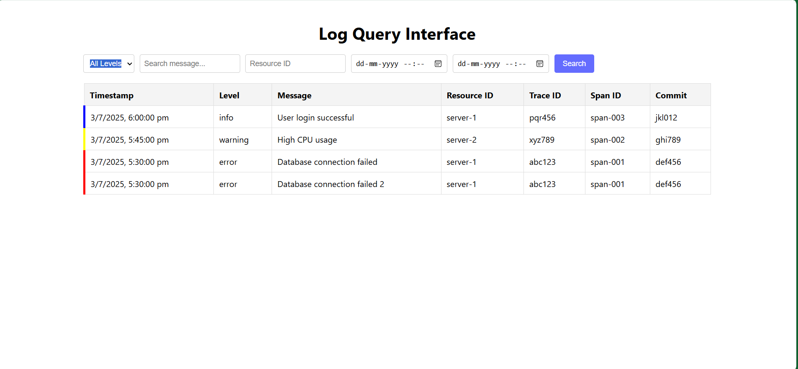
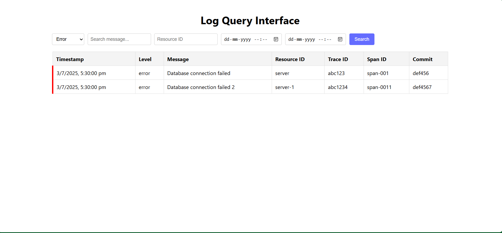
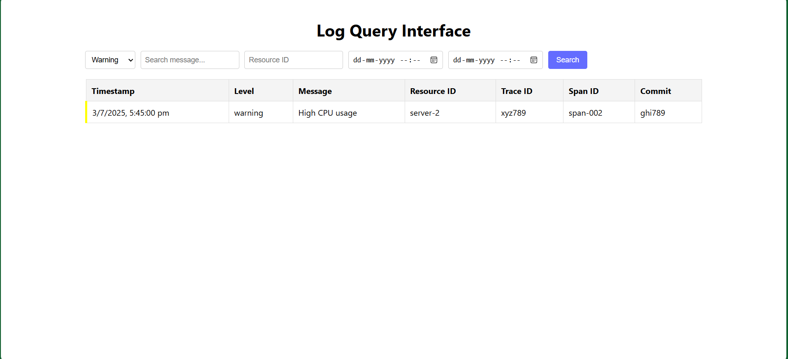
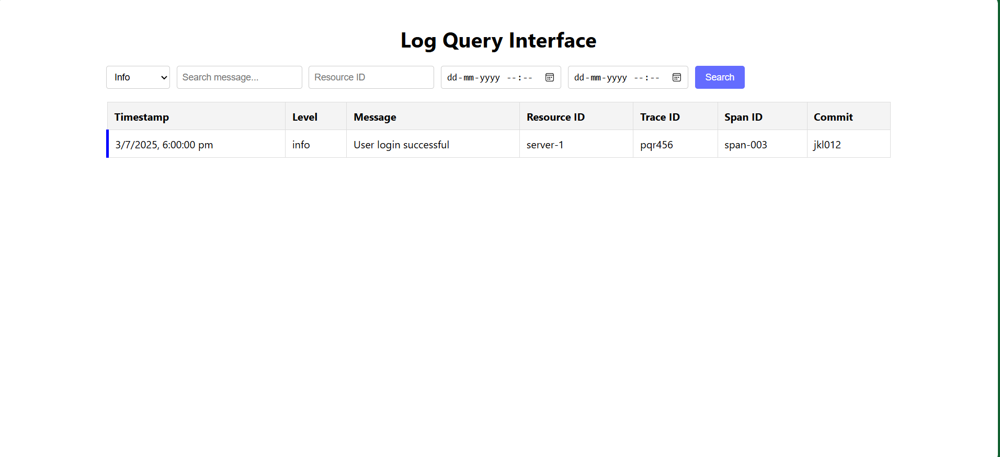

## 🔧 Backend Setup

```bash
cd backend
npm install
npm start
```

---

## 💻 Frontend Setup

```bash
cd frontend
npm install
npm run dev
```

Runs on: [http://localhost:5173](http://localhost:5173)  
If port is in use:

```bash
set PORT=5174 && npm run dev
```

---

## 🧪 Usage

### Ingest Logs (POST)

```bash
curl -X POST http://localhost:5000/api/logs \
-H "Content-Type: application/json" \
-d '{"level":"error","message":"Test error","timestamp":"2025-07-03T12:00:00.000Z","resourceId":"server-1"}'
```

**Required fields:**

```txt
level (one of: error, warning, info)
message
timestamp (ISO 8601 format)
```

**Optional fields:**

```txt
resourceId
traceId
spanId
commit
metadata
```

---

### Query Logs (GET)

Steps:

```txt
1. Open http://localhost:5173
2. Use the filter form:
   - Select level (info, warning, error)
   - Input message or resourceId
   - Select timestamp range
3. Click Search
4. View results:
   - 🔴 Red border = error
   - 🟡 Yellow border = warning
   - 🔵 Blue border = info
```

---

## 🧠 Design Decisions

### Backend

```txt
- Express: Lightweight REST API server
- fs.promises: JSON file for persistence
- Validates:
   • level field (error, warning, info)
   • timestamp (ISO 8601 format)
- Filters logs in memory (fast for small datasets)
```

### Frontend

```txt
- React 19.1.0 + Vite 7.0.0
- Functional Components using useState
- Explicit Search button for control
- Minimal custom CSS
```

---

## ❗ Error Handling

### Backend

```txt
- 400 for validation errors
- 500 for file/system errors
```

### Frontend

```txt
- Shows loading indicator
- Logs errors to console
```

---

## ⚖️ Trade-offs

| Decision            | Trade-off                                                 |
|---------------------|-----------------------------------------------------------|
| JSON file storage   | Simpler, but not scalable                                 |
| No pagination       | Faster dev, but limits large data usability               |
| No CSS framework    | Lightweight, but minimal styles                           |
| In-memory filtering | Fast for small data, not ideal for production-scale logs  |

---

## 🌟 Bonus Features

```txt
- Loading spinner on fetch
- Input validations
- Colored log borders (red, yellow, blue)
```

---

## 📝 Notes

```txt
- If logs.json doesn't exist, it's auto-initialized as []
- Logs sorted reverse-chronologically
- Backend enforces:
   • Valid level
   • Valid timestamp
```

---

## 🧪 Log Previews by Type

#### 🗂️ All Logs  


#### 🔴 Error Logs  


#### 🟡 Warning Logs  


#### 🔵 Info Logs  

